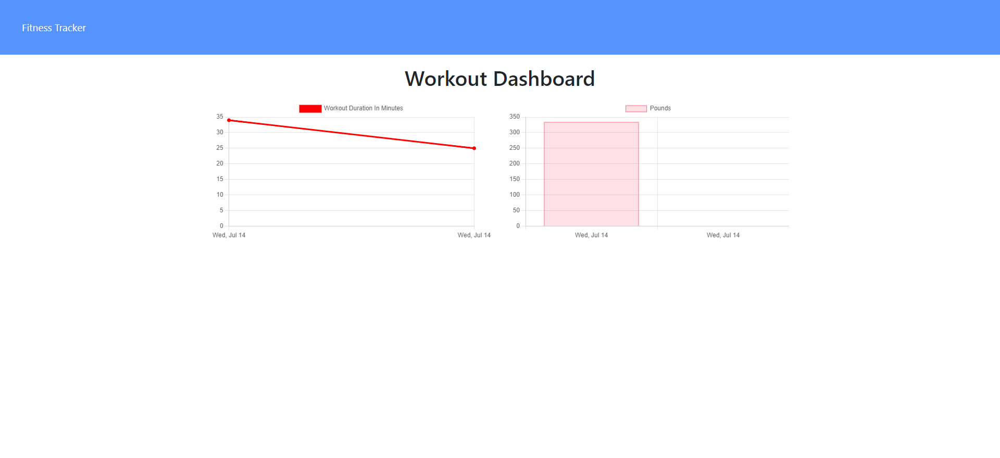
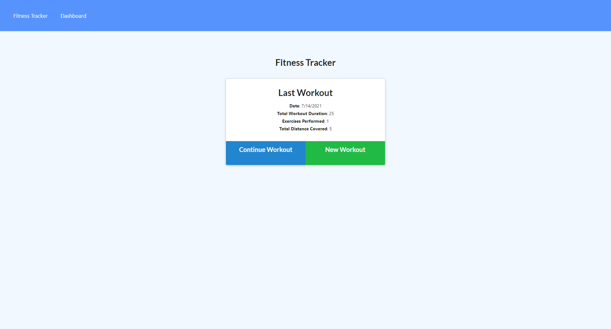

# Fitness Tracker

  

  ## Description

  Web App that allows user to create and track their daily workouts.
  Features Include:
  * Log multiple exercises with any workout on any day that specifies:
    - Name
    - Type
    - Weight
    - Sets
    - Reps
    - Duration
    - Distance for (Cardio Workouts)

  ## Table of Contents

  * [Installation](#installation)
  
  * [Screenshots](#screenshots)

  * [License](#license)

  * [Questions](#questions)

  
  ## Installation

  NPM PACKAGES
  * EXPRESS
  * LOGGER
  * MONGOOSE
  * MORGAN
  * SEED YOUR DATA with ROBO3T

  ## SCREENSHOTS
  
  

  [Deployed Link](https://piscine-vin-51733.herokuapp.com/?id=60efae2d255e380015cef64c)

  ## License
 Licensed under MIT

  ## Questions

  https://github.com/jugrajn

  If you have any questions reach me:
  * jugraj.nijjar@gmail.com

